# Data Normalization: Index Sorting


# Data Normalization: Index Sorting

## Checking if data is linear or log

### ERC_aim1_exp9_summary

``` r
library(readxl)

df_9 <- read_excel("ERC_aim1_exp9_summary.xlsx")
marker_cols_9 <- grep("_Median$", colnames(df_9), value = TRUE)

hist(df_9[[marker_cols_9[1]]],
     breaks = 80,
     main = "Raw data",
     xlab = marker_cols_9[1])
```

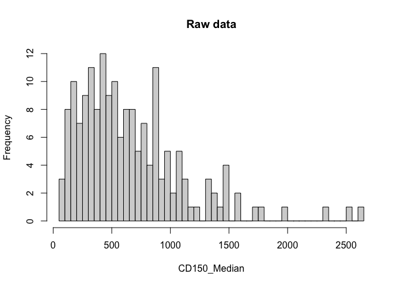

``` r
hist(df_9[[marker_cols_9[2]]],
     breaks = 80,
     main = "Raw data",
     xlab = marker_cols_9[2])
```

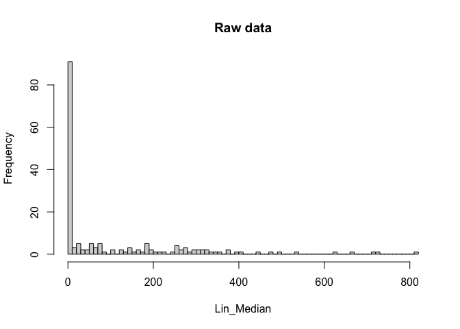

``` r
hist(df_9[[marker_cols_9[3]]],
     breaks = 80,
     main = "Raw data",
     xlab = marker_cols_9[3])
```


``` r
hist(df_9[[marker_cols_9[4]]],
     breaks = 80,
     main = "Raw data",
     xlab = marker_cols_9[4])
```

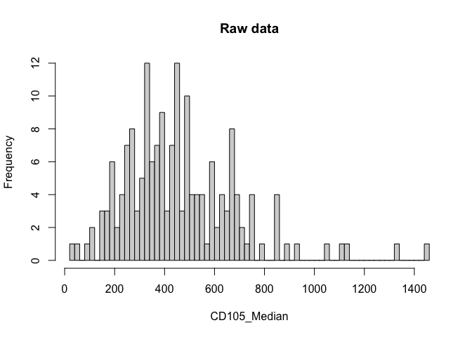

Log10 transformation

``` r
log_data_1 <- log10(df_9[[marker_cols_9[1]]])
log_data_2 <- log10(df_9[[marker_cols_9[2]]])
log_data_3 <- log10(df_9[[marker_cols_9[3]]])

hist(log_data_1,
     breaks = 50,
     main = "Log-transformed data",
     xlab = paste0("log10(", marker_cols_9[1], ")"))
```


``` r
hist(log_data_2,
     breaks = 50,
     main = "Log-transformed data",
     xlab = paste0("log10(", marker_cols_9[2], ")"))
```


``` r
hist(log_data_3,
     breaks = 50,
     main = "Log-transformed data",
     xlab = paste0("log10(", marker_cols_9[3], ")"))
```


### ERC_aim1_exp15_summary

``` r
df_15 <- read_excel("ERC_aim1_exp15_summary.xlsx")
marker_cols_15 <- grep("_Median$", colnames(df_15), value = TRUE)
df_15[marker_cols_15] <- lapply(df_15[marker_cols_15], function(x) {
  as.numeric(gsub(",", ".", x))
})


hist(df_15[[marker_cols_15[1]]],
     breaks = 80,
     main = "Raw data",
     xlab = marker_cols_15[1])
```


``` r
hist(df_15[[marker_cols_15[2]]],
     breaks = 80,
     main = "Raw data",
     xlab = marker_cols_15[2])
```


``` r
hist(df_15[[marker_cols_15[3]]],
     breaks = 80,
     main = "Raw data",
     xlab = marker_cols_15[3])
```


``` r
hist(df_15[[marker_cols_15[4]]],
     breaks = 80,
     main = "Raw data",
     xlab = marker_cols_15[4])
```


Log10 transformation

``` r
log_data_1 <- log10(df_15[[marker_cols_15[1]]])
log_data_2 <- log10(df_15[[marker_cols_15[2]]])
log_data_3 <- log10(df_15[[marker_cols_15[3]]])

hist(log_data_1,
     breaks = 50,
     main = "Log-transformed data",
     xlab = paste0("log10(", marker_cols_15[1], ")"))
```


``` r
hist(log_data_2,
     breaks = 50,
     main = "Log-transformed data",
     xlab = paste0("log10(", marker_cols_15[2], ")"))
```

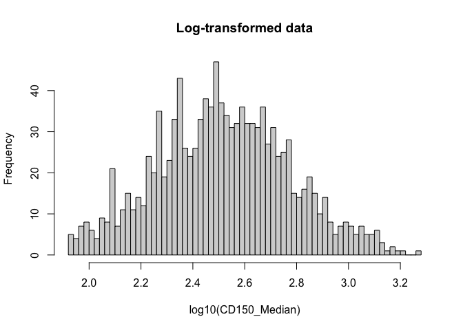

``` r
hist(log_data_3,
     breaks = 50,
     main = "Log-transformed data",
     xlab = paste0("log10(", marker_cols_15[3], ")"))
```


### ERC_aim_exp13_summary

``` r
df_13 <- read_excel("ERC_aim1_exp13_summary1.xlsx")
marker_cols_13 <- grep("_Median$", colnames(df_13), value = TRUE)

df_13[marker_cols_13] <- lapply(df_13[marker_cols_13], function(x) {
  as.numeric(gsub(",", ".", x))
})

hist(df_13[[marker_cols_13[1]]],
     breaks = 80,
     main = "Raw data",
     xlab = marker_cols_13[1])
```


``` r
hist(df_13[[marker_cols_13[2]]],
     breaks = 80,
     main = "Raw data",
     xlab = marker_cols_13[2])
```


``` r
hist(df_13[[marker_cols_13[3]]],
     breaks = 80,
     main = "Raw data",
     xlab = marker_cols_13[3])
```


``` r
hist(df_13[[marker_cols_13[4]]],
     breaks = 80,
     main = "Raw data",
     xlab = marker_cols_13[4])
```

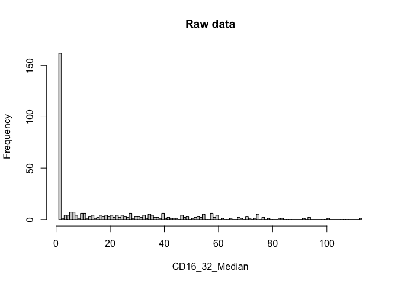

``` r
log_data_1 <- log10(df_13[[marker_cols_13[1]]])
log_data_2 <- log10(df_13[[marker_cols_13[2]]])
log_data_3 <- log10(df_13[[marker_cols_13[3]]])

hist(log_data_1,
     breaks = 50,
     main = "Log-transformed data",
     xlab = paste0("log10(", marker_cols_13[1], ")"))
```

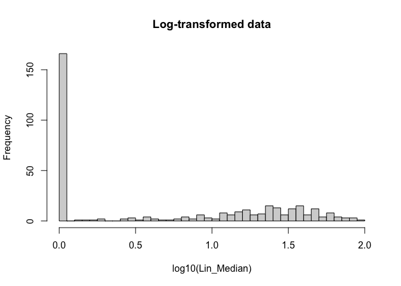

``` r
hist(log_data_2,
     breaks = 50,
     main = "Log-transformed data",
     xlab = paste0("log10(", marker_cols_13[2], ")"))
```

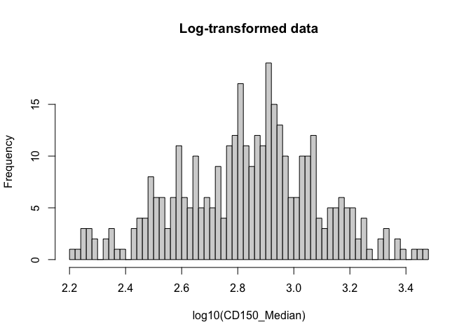

``` r
hist(log_data_3,
     breaks = 50,
     main = "Log-transformed data",
     xlab = paste0("log10(", marker_cols_13[3], ")"))
```


### As we can see after logarithm transformation the distirbution is way better

## Log transformation

### Comparing log_10, ln, log1p and asinh

#### comparing for marker from ERC_aim1_exp_9

``` r
#log 10
df_log_9 <- df_9
df_log_9[marker_cols_9] <- log10(df_9[marker_cols_9])

hist(df_9[[marker_cols_9[8]]],
     breaks = 50,
     main = "before log - Raw data",
     xlab = marker_cols_9[8]
     )
```


``` r
hist(df_log_9[[marker_cols_9[8]]],
     breaks = 50,
     main = "after log10",
     xlab = paste0("log10(", marker_cols_9[8], ")")
     )
```

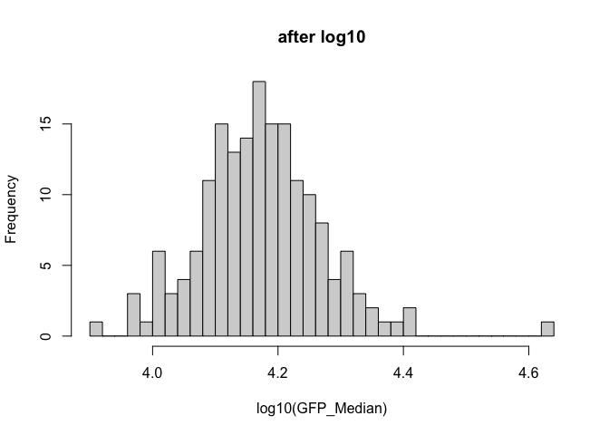

``` r
#ln
df_log_n <- df_9
df_log_n[marker_cols_9] <- log(df_9[marker_cols_9])


hist(df_log_n[[marker_cols_9[8]]],
     breaks = 50,
     main = "after log (natural)",
     xlab = paste0("log(", marker_cols_9[8], ")")
)
```


``` r
#log 1p
df_log_1p <- df_9
df_log_1p[marker_cols_9] <- log1p(df_9[marker_cols_9])


hist(df_log_1p[[marker_cols_9[8]]],
     breaks = 50,
     main = "after log 1p",
     xlab = paste0("log(", marker_cols_9[8], ")")
)
```


``` r
#asinh
df_log_asinh <- df_9
df_log_asinh[marker_cols_9] <- asinh(df_9[marker_cols_9] / 150)


hist(df_log_asinh[[marker_cols_9[8]]],
     breaks = 50,
     main = "after asinh",
     xlab = paste0("log(", marker_cols_9[8], ")")
)
```


#### comparing for marker from file ERC_aim1_exp15

``` r
#log_10
df_log_15 <- df_15
df_log_15[marker_cols_15] <- log10(df_15[marker_cols_15])

hist(df_15[[marker_cols_15[5]]],
     breaks = 50,
     main = "before log - Raw data",
     xlab = marker_cols_15[5]
     )
```


``` r
hist(df_log_15[[marker_cols_15[5]]],
     breaks = 50,
     main = "after log10",
     xlab = paste0("log10(", marker_cols_15[5], ")")
     )
```

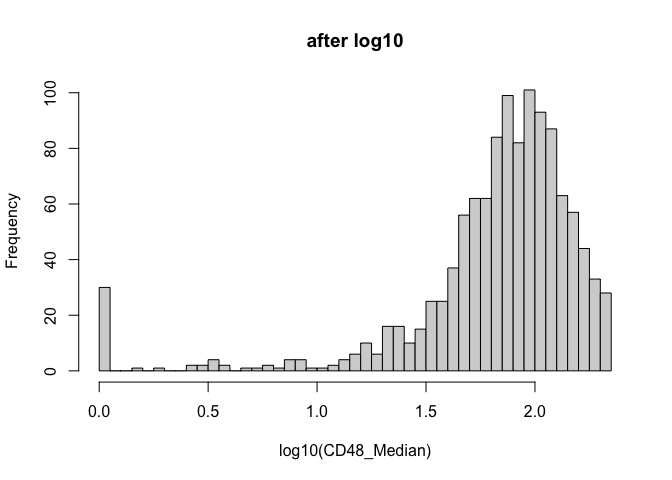

``` r
#ln
df_log_n <- df_15
df_log_n[marker_cols_15] <- log(df_15[marker_cols_15])

hist(df_log_n[[marker_cols_15[5]]],
     breaks = 50,
     main = "after log (natural)",
     xlab = paste0("log(", marker_cols_15[5], ")")
)
```


``` r
#log 1p
df_log_1p <- df_15
df_log_1p[marker_cols_15] <- log1p(df_15[marker_cols_15])

hist(df_log_1p[[marker_cols_15[5]]],
     breaks = 50,
     main = "after log 1p",
     xlab = paste0("log(", marker_cols_15[5], ")")
)
```


``` r
#asinh
df_log_asinh <- df_15
df_log_asinh[marker_cols_15] <- asinh(df_15[marker_cols_15] / 150)

hist(df_log_asinh[[marker_cols_15[5]]],
     breaks = 50,
     main = "after asinh",
     xlab = paste0("log(", marker_cols_15[5], ")")
)
```


We decide on using log_10 in furter analysis as it seem to work best

### Log_10 transformation ERC_aim1_exp_9

``` r
for (m in marker_cols_9) {
  hist((df_log_9[[m]]),
       breaks = 80,
       main = paste("After log transformation:", m),
       xlab = paste0("log(", marker_cols_9[m], ")"))
}
```

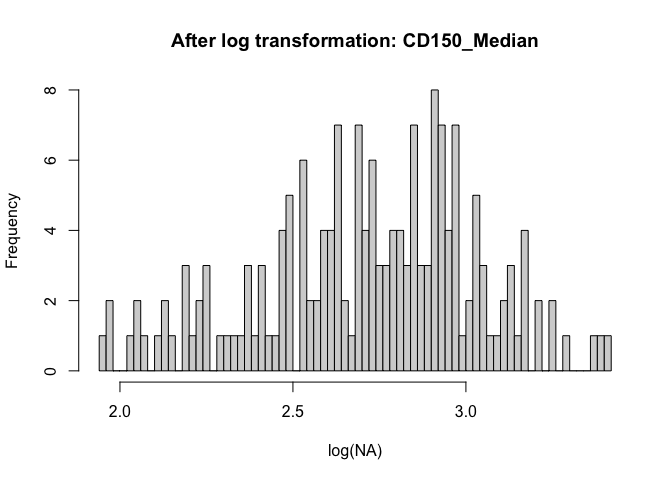


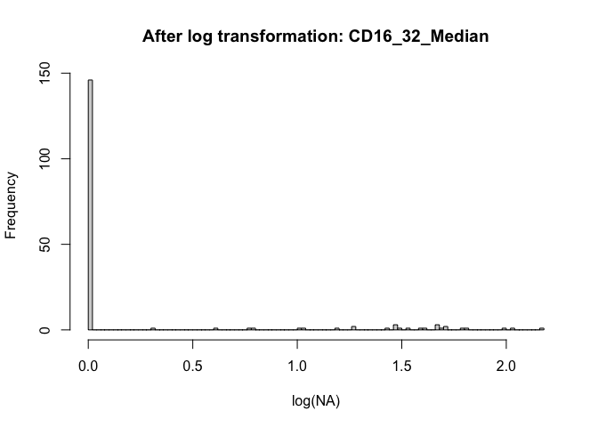


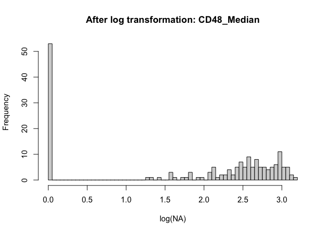


### Log_10 transformation ERC_aim1_exp_15

``` r
for (m in marker_cols_15) {
  hist((df_log_15[[m]]),
       breaks = 80,
       main = paste("After log transformation:", m),
       xlab = paste0("log(", marker_cols_15[m], ")"))
}
```

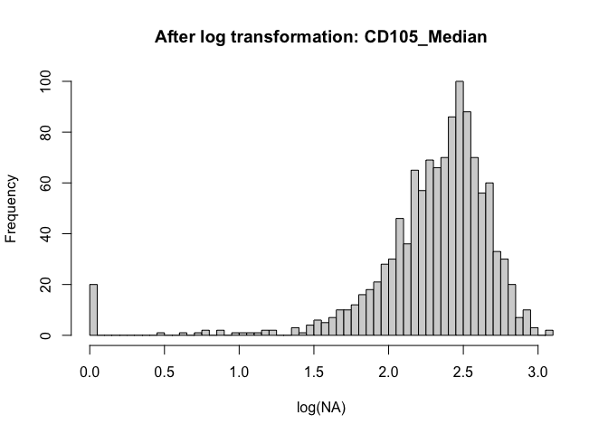


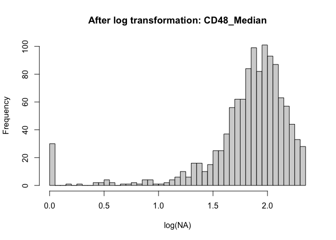

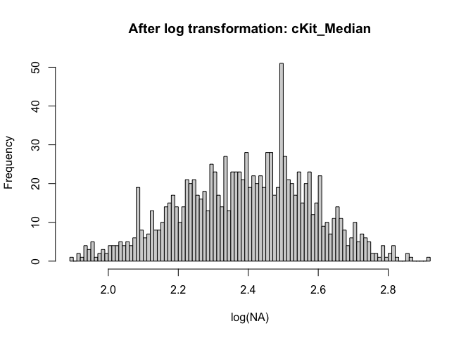


### Log_10 transformation ERC_aim1_exp_13

``` r
df_log_13 <- df_13
df_log_13[marker_cols_13] <- log10(df_13[marker_cols_13])

for (m in marker_cols_13) {
  hist((df_log_13[[m]]),
       breaks = 80,
       main = paste("After log transformation:", m),
       xlab = paste0("log(", marker_cols_13[m], ")"))
}
```


## Z-score scalling

### scalling ERC_aim1_exp_9

``` r
df_scaled_9 <- df_log_9
df_scaled_9[marker_cols_9] <- scale(df_log_9[marker_cols_9])
boxplot(df_scaled_9[marker_cols_9],
        main="log10 + z-score (scaled)",
        las=2)
```

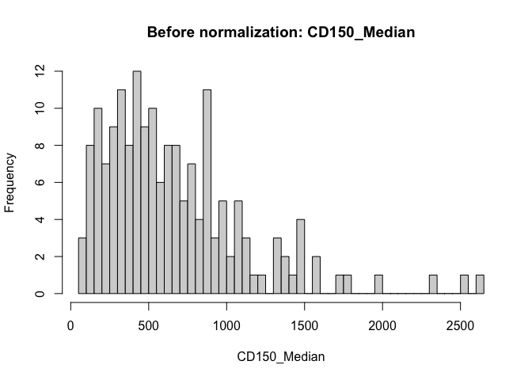

``` r
hist(df_scaled_9[[marker_cols_9[8]]],
     breaks = 80,
     main = "after scalling",
     xlab = paste0("scale(", marker_cols_9[8], ")")
)
```


``` r
for (m in marker_cols_9) {
  hist(df_9[[m]],
       breaks = 80,
       main = paste("Before normalization:", m),
       xlab = m)

  hist((df_scaled_9[[m]]),
       breaks = 80,
       main = paste("After scalling:", m),
       xlab = paste0("log(", m, ")"))
}
```


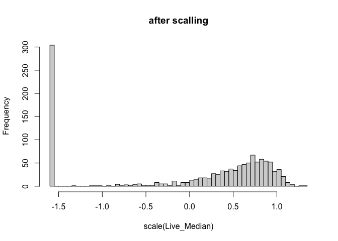


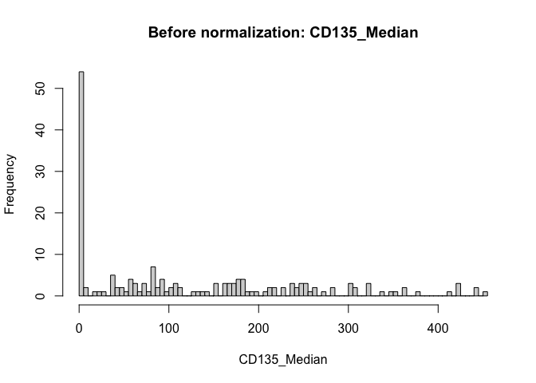


### scalling ERC_aim1_exp_15

``` r
df_scaled_15 <- df_log_15
df_scaled_15[marker_cols_15] <- scale(df_log_15[marker_cols_15])
boxplot(df_scaled_15[marker_cols_15],
        main="log10 + z-score (scaled)",
        las=2)
```

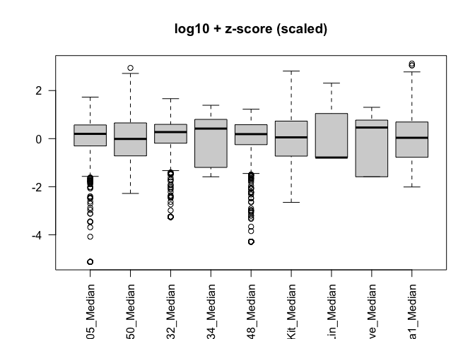

``` r
hist(df_scaled_15[[marker_cols_15[8]]],
     breaks = 80,
     main = "after scalling",
     xlab = paste0("scale(", marker_cols_15[8], ")")
)
```


``` r
for (m in marker_cols_15) {
  hist(df_15[[m]],
       breaks = 80,
       main = paste("Before normalization:", m),
       xlab = m)

  hist((df_scaled_15[[m]]),
       breaks = 80,
       main = paste("After scalling:", m),
       xlab = paste0("log(", m, ")"))
}
```


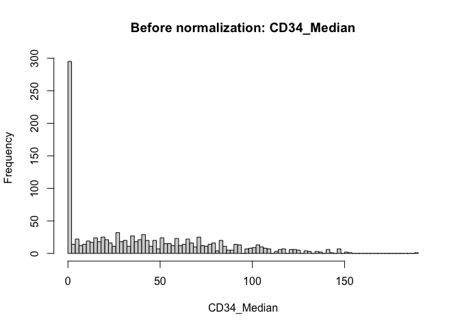


### scalling ERC_aim1_exp_13

``` r
df_scaled_13 <- df_log_13
df_scaled_13[marker_cols_13] <- scale(df_log_13[marker_cols_13])

num_cols <- sapply(df_scaled_13, is.numeric)
df_scaled_13[, num_cols] <- lapply(df_scaled_13[, num_cols], function(x) {
  x[is.na(x) | is.infinite(x)] <- 0
  x
})

df_scaled_13[marker_cols_13]
```

    # A tibble: 361 × 12
       Lin_Median CD150_Median CD48_Median CD16_32_Median CD105_Median CD71_Median
            <dbl>        <dbl>       <dbl>          <dbl>        <dbl>       <dbl>
     1     -0.972      -0.0584       0.742         1.03       -1.51          0.373
     2      1.24        0.531        0.548         1.15       -0.00399       0.657
     3     -0.794       0.885        0.392        -1.01        0.336        -1.53 
     4      0.333       1.12         1.03         -1.01        1.01         -0.171
     5      1.40        0.846        0.684        -1.01        0.239         0.580
     6     -0.972       2.38         0.937         1.11        1.21          0.645
     7      0.882       0.296        0.315        -1.01       -0.101         1.07 
     8      0.745       1.16         0.237         0.796       0.190        -1.53 
     9      0.827       1.36         0.917         1.04        2.91          0.865
    10     -0.972       1.40         0.412         0.0408      0.675         1.02 
    # ℹ 351 more rows
    # ℹ 6 more variables: cKit_Median <dbl>, GFP_Median <dbl>, Live_Median <dbl>,
    #   CD135_Median <dbl>, sca1_Median <dbl>, CD34_Median <dbl>

``` r
boxplot(df_scaled_13[marker_cols_13],
        main="log10 + z-score (scaled)",
        las=2)
```


``` r
hist(df_scaled_13[[marker_cols_13[8]]],
     breaks = 80,
     main = "after scalling",
     xlab = paste0("scale(", marker_cols_13[8], ")")
)
```

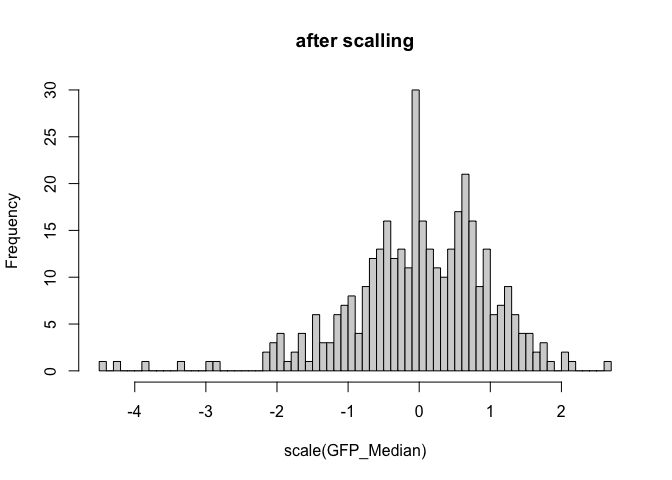

``` r
for (m in marker_cols_13) {
  hist(df_13[[m]],
       breaks = 80,
       main = paste("Before normalization:", m),
       xlab = m)

  hist((df_scaled_13[[m]]),
       breaks = 80,
       main = paste("After scalling:", m),
       xlab = paste0("log(", m, ")"))
}
```


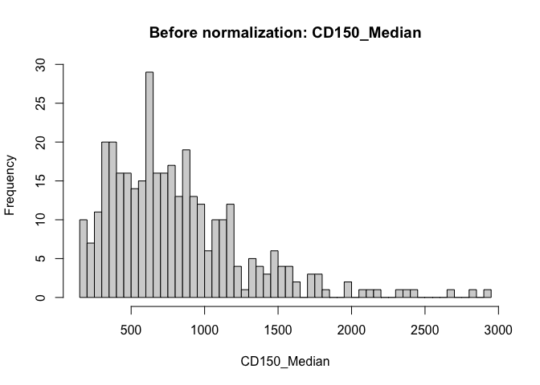


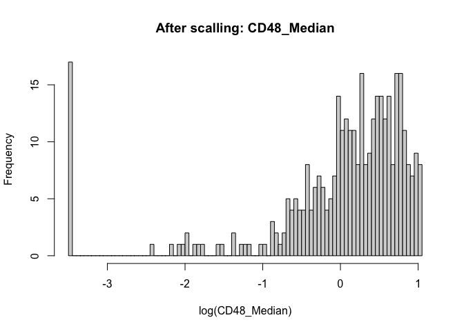


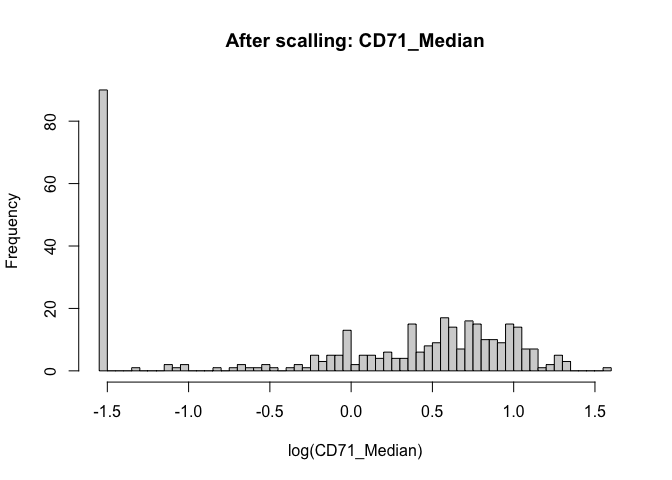


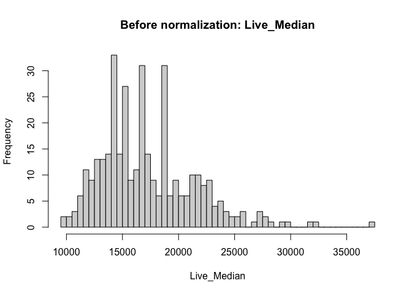

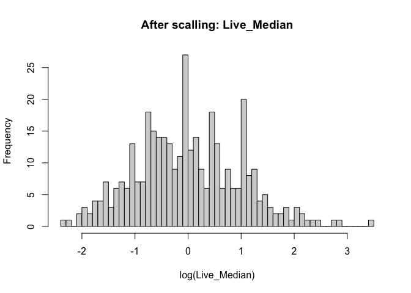


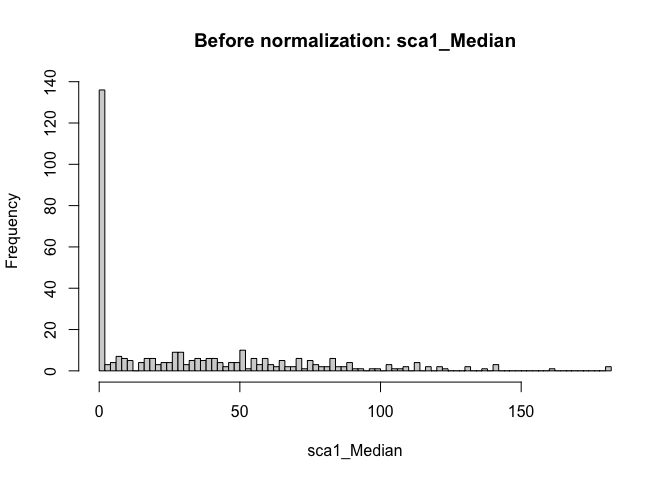


## PCA

#### PCA ERC_aim1_exp9_summary.xlsx

``` r
pca_9 <- prcomp(df_scaled_9[marker_cols_9])
plot(pca_9$x[,1], pca_9$x[,2])
```


``` r
pca_var_9 <- pca_9$sdev^2 # how much variation in the original data each principal component accounts for
pca_var_per_9 <- round(pca_var_9/sum(pca_var_9)*100,1)
pca_var_per_9
```

     [1] 20.1 14.3 12.2  8.9  8.2  7.6  7.2  5.8  4.6  3.8  2.9  2.6  1.7

``` r
barplot( pca_var_per_9, main = "scree plot", xlab = "principal component", ylab = "percent variation")
```

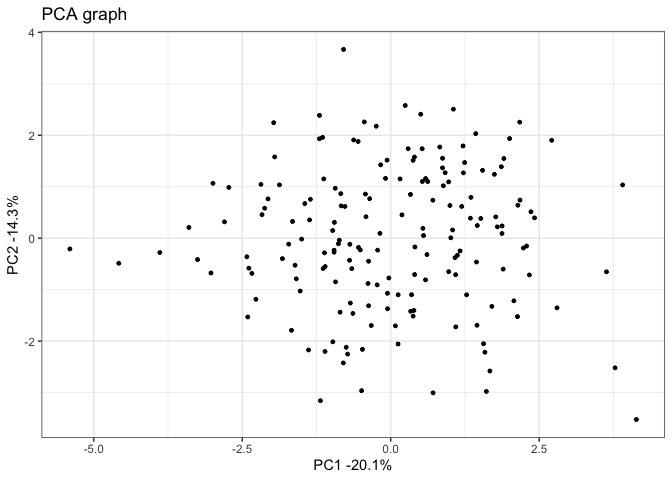

slight difference beetwen 2 and 3, maybe PC1 vs PC3 or PC2 vs PC3?
delete outliers?

``` r
library(ggplot2)

pca_9.data <- data.frame(Sample = df_9$Row.names,
  X = pca_9$x[,1],
  Y = pca_9$x[,2])

ggplot(data = pca_9.data, aes(x = X, y = Y, label = Sample))+
  geom_point(size = 1)+
  xlab(paste("PC1 -", pca_var_per_9[1], "%", sep = ""))+
  ylab(paste("PC2 -", pca_var_per_9[2], "%", sep = ""))+
  theme_bw()+
  ggtitle("PCA graph")
```


``` r
loading_scores_9 <- pca_9$rotation[,1]
marker_scores_9 <- abs(loading_scores_9)
markers_score_ranked_9 <- sort(marker_scores_9, decreasing = TRUE)
top_5_markers_9 <- names(markers_score_ranked_9[1:5])

top5_loadings_9 <- data.frame(
  Marker = top_5_markers_9,
  Loading = pca_9$rotation[top_5_markers_9, 1] #show the scores and sign (+/-)
)

top5_loadings_9
```

                       Marker    Loading
    CD105_Median CD105_Median  0.4524419
    GFP_Median     GFP_Median  0.4398952
    CD150_Median CD150_Median  0.4099102
    Live_Median   Live_Median  0.3428536
    Lin_Median     Lin_Median -0.2755929

#### PCA ERC_aim1_exp15_summary.xlsx

``` r
pca_15 <- prcomp(df_scaled_15[marker_cols_15])
plot(pca_15$x[,1], pca_15$x[,2])
```


``` r
pca_var_15 <- pca_15$sdev^2 # how much variation in the original data each principal component accounts for
pca_var_per_15 <- round(pca_var_15 / sum(pca_var_15)*100,1)
pca_var_per_15
```

    [1] 20.4 17.2 14.3 11.2  9.6  8.6  7.3  5.9  5.5

``` r
barplot( pca_var_per_15, main = "scree plot", xlab = "principal component", ylab = "percent variation")
```


``` r
library(ggplot2)

pca_15.data <- data.frame(Sample = 1:nrow(df_15),
  X = pca_15$x[,1],
  Y = pca_15$x[,2])

ggplot(data = pca_15.data, aes(x = X, y = Y, label = Sample))+
  geom_point(size = 1)+
  xlab(paste("PC1 -", pca_var_per_15[1], "%", sep = ""))+
  ylab(paste("PC2 -", pca_var_per_15[2], "%", sep = ""))+
  theme_bw()+
  ggtitle("PCA graph")
```


``` r
loading_scores_15 <- pca_15$rotation[,1]
marker_scores_15 <- abs(loading_scores_15)
markers_score_ranked_15 <- sort(marker_scores_15, decreasing = TRUE)
top_5_markers_15 <- names(markers_score_ranked_15[1:5])

top5_loadings_15 <- data.frame(
  Marker = top_5_markers_15,
  Loading = pca_15$rotation[top_5_markers_15, 1] #show the scores and sign (+/-)
)

top5_loadings_15
```

                           Marker    Loading
    CD34_Median       CD34_Median  0.4732188
    CD150_Median     CD150_Median -0.4675962
    CD105_Median     CD105_Median -0.4530575
    CD16_32_Median CD16_32_Median  0.3732949
    sca1_Median       sca1_Median -0.2842991

#### PCA ERC_aim1_exp13_summary.xlsx

``` r
pca_13 <- prcomp(df_scaled_13[marker_cols_13])
plot(pca_13$x[,1], pca_13$x[,2])
```


``` r
pca_var_13 <- pca_13$sdev^2 # how much variation in the original data each principal component accounts for
pca_var_per_13 <- round(pca_var_13/sum(pca_var_13)*100,1)
pca_var_per_13
```

     [1] 21.8 15.0 12.4  8.6  8.1  7.6  6.7  5.6  4.2  3.8  3.5  2.6

``` r
barplot( pca_var_per_13, main = "scree plot", xlab = "principal component", ylab = "percent variation")
```


``` r
library(ggplot2)

pca_13.data <- data.frame(Sample = df_13$Row.names,
  X = pca_13$x[,1],
  Y = pca_13$x[,2])

ggplot(data = pca_13.data, aes(x = X, y = Y, label = Sample))+
  geom_point(size = 1)+
  xlab(paste("PC1 -", pca_var_per_13[1], "%", sep = ""))+
  ylab(paste("PC2 -", pca_var_per_13[2], "%", sep = ""))+
  theme_bw()+
  ggtitle("PCA graph")
```

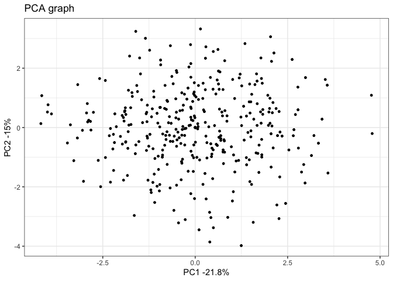

``` r
loading_scores_13 <- pca_13$rotation[,1]
marker_scores_13 <- abs(loading_scores_13)
markers_score_ranked_13 <- sort(marker_scores_13, decreasing = TRUE)
top_5_markers_13 <- names(markers_score_ranked_13[1:5])

top5_loadings_13 <- data.frame(
  Marker = top_5_markers_13,
  Loading = pca_13$rotation[top_5_markers_13, 1] #show the scores and sign (+/-)
)

top5_loadings_13
```

                       Marker    Loading
    Live_Median   Live_Median  0.5223301
    CD34_Median   CD34_Median  0.4240742
    CD105_Median CD105_Median  0.4217022
    CD150_Median CD150_Median  0.3950798
    cKit_Median   cKit_Median -0.2626954
